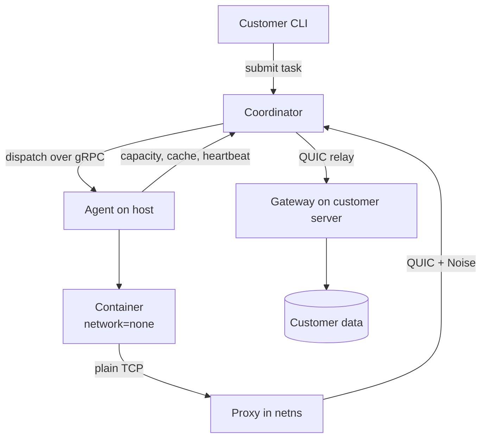

# LazyCake — Design Plan

*As of 2026-09-24*

## Overview

LazyCake is a marketplace for leftover CPU. Hosts rent out idle cores; customers run batch containers on them. Hosts install an agent, declare how much CPU, RAM, disk and bandwidth they will rent out, and get paid when tasks run on their machine. Customers submit containerised batch tasks that need no low latency and no interactive access.

**Hosts** run the agent against a rootless Podman or Docker runtime and hold a persistent outbound connection to the coordinator.

**Customers** submit tasks and install a **gateway** on the servers holding their data. Installing the gateway is what proves they control those servers. A task reaches at most three registered gateways and nothing else.

### Scope

- CPU only, no GPU.
- Containers only, pinned by digest.
- Batch only. No interactive sessions, no SSH, no long-lived services.
- Portfolio-grade. Success is a working, demoable system with a defensible design. The unit economics are unfavourable at consumer scale and that analysis is deliberately out of scope.

**What makes this distinct** from Bacalhau, HTCondor and BOINC is holding three properties at once: untrusted strangers' machines, real money changing hands, and arbitrary customer containers. None of those three systems carries all three, which is why none of them has to solve metering that neither party can game. That problem is this design's centre of gravity.

---

## Decision log

Ten decisions are settled. Each is revisitable, but later work assumes them.

| # | Decision | Choice | Why |
| --- | --- | --- | --- |
| 1 | Data path | Direct customer-to-container through a tunnel. No staged inputs or outputs. | Inspecting payloads costs compute and creates data-processor compliance exposure. |
| 2 | Billing unit | Base fee per task + provisioned CPU, RAM and disk over time + bandwidth measured at the gateway. | Matches what is actually consumed; hosts declare an offer so free capacity is known. |
| 3 | Placement | Coordinator assigns. Agents report capacity and cached images. Image cache is a tiebreak. | Global placement control without an offer/bid market to build. |
| 4 | Stack | Go for coordinator and agent. gRPC over TCP for control, QUIC for data. Postgres for state. | Single static binary agent, no runtime to install on a stranger's machine. |
| 5 | Isolation | Rootless Podman baseline, gVisor optional. Isolation level is a node capability and a task requirement. | Never touches a root-equivalent Docker socket; hardening becomes a priced feature. |
| 6 | Tunnel | QUIC, relayed through the coordinator, with an inner Noise layer. Direct P2P later. | Works through every NAT with no hole-punching logic; the relay carries ciphertext only. |
| 7 | Disconnect | Agent self-fences. Containers run for 2x the reconnect period, then the agent kills them. | Blips cost nothing; no split-brain window before the coordinator requeues. |
| 8 | Work shape | Flat tasks. No jobs, no fan-out, no DAG. | `max_duration` plus account balance already bound runaway spend. |
| 9 | Availability | Always on, bounded by the host's offer and the capability probe. | Exact provisioning already does the work idle-detection would do. |
| 10 | Confidentiality | Not attempted on consumer hardware. Disclosed honestly, tiered by hardware. | No TEE exists on consumer silicon; see the threat model section. |

**Deferred, not rejected:** offer/bid matching, job fan-out with budget ceilings, scheduled availability windows, direct P2P transport, and attested Tier A hosts.

---

## Architecture

Three components, and a strict split between the control plane and the data plane.



**Coordinator.** Owns all state in Postgres. Holds a gRPC bidirectional stream per agent for dispatch, heartbeats, capacity reports, cache deltas, status and logs. Separately relays QUIC tunnel frames it cannot decrypt. Task queue is `SELECT ... FOR UPDATE SKIP LOCKED`, so multiple replicas work with no message broker.

**Agent.** One static Go binary. Talks to Podman through the Docker-compatible socket API, so a single `Runtime` implementation covers both runtimes. Runs its own capacity ledger and admission control, since the coordinator's view is always slightly stale. Is the final authority on whether a dispatched task fits.

**Gateway.** Customer-installed. Terminates the Noise session, forwards to local services, and counts bytes independently of the agent.

The direct-tunnel decision removed object storage from the design entirely. There is no MinIO and no blob staging.

---

## Task descriptor

```json
{
  "task_id": "...",
  "idempotency_key": "...",

  "image": "registry/foo@sha256:abc...",
  "entrypoint": ["..."],
  "args": ["..."],
  "env": {},
  "workdir": "/work",

  "limits": {
    "cpu_cores": 2,
    "memory_mb": 2048,
    "disk_mb": 4096,
    "tmpfs_mb": 512,
    "pids": 256,
    "wall_timeout_s": 900,
    "no_output_timeout_s": 120,
    "egress_mb": 500
  },

  "requires": {
    "arch": "amd64",
    "cpu_flags": ["avx2"],
    "isolation": "podman",
    "confidentiality": "none"
  },

  "network": {
    "gateways": ["gw_abc:5432", "gw_def:443"],
    "max": 3
  },

  "delivery": "at_most_once",
  "retry": { "max_attempts": 1, "retryable_exit_codes": [75] },

  "lease": { "duration_s": 60, "heartbeat_s": 15 }
}
```

**Image is always a digest, never a tag.** A digest is immutable, so a cached layer can never be the wrong version, which removes staleness as a correctness concern and leaves only garbage collection.

**Delivery defaults to `at_most_once`.** Without declared inputs and outputs a task is not a pure function, so a retry may double-write into the customer's database. A task that dies is reported failed and not retried unless the customer explicitly opts into `at_least_once` and asserts their own idempotency.

**Overage contract.** Exceeding memory means an OOM kill by the cgroup, reported as a distinct exit reason and billed anyway since the resources were held. Exceeding disk means write failures. Exceeding CPU means throttling, not death.

**`isolation` and `confidentiality` are matched against node capabilities**, the same way `arch` and `cpu_flags` are. A node advertises only what its preflight probe proved it can enforce.

---

## Agent and host

### Rootless constraints

**cgroups v2 delegation is load-bearing.** Rootless Podman enforces memory and CPU limits only if the user's systemd slice has `Delegate=yes` on a cgroups v2 unified host. Without it the limits silently do not apply, and since billing is on provisioned resources, the whole contract fails quietly. Use `crun`, not `runc`.

**Preflight capability probe.** At install and at every startup, the agent tests what it can actually enforce: memory limit, CPU quota, pids limit, disk cap, gVisor availability. It advertises only what passed. Discovering a missing capability at dispatch time is too late.

**subuid/subgid ranges** must exist for the agent's user. Missing or undersized ranges is the most common rootless Podman failure, so detect it explicitly rather than letting Podman's error leak through.

**Per-task disk limits are the hard one.** XFS project quotas need root. The workable path is a sparse file per task mounted as its scratch directory, so the filesystem image enforces the cap, plus monitoring the container's writable layer and killing on breach.

### Offer and admission

The agent clamps whatever the host's slider says: cap at roughly 75% of physical cores, leave several GB of RAM and real disk headroom. A host who offers everything and then cannot open a browser will call it malware.

A node runs several tasks concurrently, so the agent keeps its own capacity ledger. The coordinator reserves optimistically and dispatches; the agent may reject; the coordinator requeues. Without that veto, two 3 GB tasks eventually land in 4 GB of free RAM.

Never overcommit RAM or disk, since that means selling the same gigabyte twice. Lowering an offer mid-flight drains rather than evicts: the reduction applies to new admissions only. Thermal backoff sheds capacity before the machine throttles itself.

### Lease and fencing

The agent holds a lease with a locally enforced deadline. Containers keep running while the deadline is in the future and the agent kills them itself once it passes without a successful heartbeat.

**The invariant:** the coordinator's requeue deadline must always be later than the agent's fence deadline. It holds naturally if the agent measures from when it *sent* its last acknowledged heartbeat and the coordinator measures from when it *received* it. Monotonic clocks on both sides, never wall clock.

### Killing orphans

If the agent is `SIGKILL`ed it runs no cleanup code, so signal handlers and `defer` are useless. The fence must be enforced from outside the agent.

1. **systemd user slice.** Agent runs under a slice with `Delegate=yes`; every task container is a transient unit inside it with `KillMode=control-group`. When the agent's scope dies for any reason, including a force-quit of the desktop app, systemd tears down the whole control group. Composes with the cgroups delegation already required.
2. **Deadline inside the container.** A small static wrapper bind-mounted in, wrapping the customer's entrypoint, hard-exits at `max_duration` regardless of anything outside. Covers non-systemd hosts and is the only option if macOS or Windows agents are ever in scope.
3. **Startup reconciliation sweep.** Label every container with the agent instance ID and the machine's boot ID. On start, kill any labelled container not matching the current run. Catches crash-restart loops and hosts that lost power mid-task.

Graceful first: `SIGTERM`, a short grace period, then `SIGKILL`, so workloads can close tunnel connections cleanly.

### Image cache

Two separate disk budgets: a host-set image cache pool shared across tasks, and per-task ephemeral disk that is provisioned and billed. Keep them apart or a pull starves a running task's scratch space.

Eviction is LRU under budget pressure plus a TTL that drops anything unused for a few days even when there is room. Never evict layers backing a running container.

Agents report cache **deltas** (pulled X, evicted Y) plus a full reconciliation every few minutes, rather than the whole digest list on every heartbeat.

Placement scores fit plus a cache bonus scaled by image size, minus current queue depth. A hard cache preference sends every task for a popular image to the one node holding it while the rest of the fleet idles.

Rate-limit cold pulls per task family. Dispatching a 2 GB image to 50 nodes at once is 100 GB of registry egress and 50 saturated residential uplinks.

---

## Networking

### The gateway is the enforcement boundary

No DNS filtering, no CONNECT proxy, no allowlist to bypass. The container runs `--network=none` plus one interface into a namespace whose only route is the tunnel. Unlisted hosts are unreachable by construction, not by policy — raw IPs have no route and DNS-over-HTTPS has nowhere to go. The agent pulls container images outside that namespace, so registry access is not a hole.

Maximum three gateways per task.

### How the container addresses its targets

The container knows nothing about any of this. A stub resolver in its netns resolves only the allowed names, each to a distinct loopback or private address bound by the proxy. Customer code connects to `db.acme.com:5432` unchanged and the proxy maps that address to a QUIC stream toward the right gateway. Anything else fails to resolve.

### Transport

QUIC, relayed through the coordinator. Works through every NAT with no hole-punching logic. Direct P2P is a later transport upgrade that changes routing without touching anything above it.

**QUIC's own TLS does not give end-to-end encryption through a relay.** The relay terminates those sessions and would see plaintext. An inner Noise session (`flynn/noise`, Noise_IK) runs between the agent's proxy and the gateway, with static keys exchanged at gateway registration. Outer QUIC for transport, inner Noise for confidentiality.

**One QUIC stream per container connection.** Native multiplexing, so no hand-rolled framing and no head-of-line blocking between a bulk transfer and a control connection.

**Connection migration** means a host moving from wifi to ethernet, or a laptop waking on a different network, does not drop live tunnels.

**TCP fallback for the relay leg.** Some corporate and hotel networks block UDP outright, which would otherwise make a host unusable.

### Three independent byte counters

The agent, the coordinator relay and the gateway all count bytes. The gateway is customer-installed software, so it is an honest measurement point that most marketplaces do not have. Any two counters disagreeing is a signal worth acting on.

---

## Confidentiality and threat model

**The position: a host on consumer hardware can read the workload running on their machine, and the platform says so plainly rather than implying otherwise.**

### Why it cannot be solved

The host has root on their own hardware. They can read `/proc/<pid>/mem`, attach a debugger, snapshot RAM, read the container filesystem off their own disk, run a patched kernel, or run a modified build of the agent. No software running on a machine can defend against software with more privilege on that same machine.

The only real defence is a hardware TEE with remote attestation, and consumer silicon does not have one. AMD SEV-SNP is available on EPYC processors from the third-generation Milan microarchitecture onward, not on desktop Ryzen. Intel TDX shipped as part of the 4th Generation Xeon Scalable processor. Intel SGX was deprecated in 2021 except on the Xeon line, so the one TEE that ever shipped on client chips was removed from them years ago. A gaming PC has no root of trust to attest against.

Note that rootless Podman gives nothing here. It protects the host from the container, which is the opposite direction.

### Correction to the tunnel design

The Noise layer inside the QUIC tunnel protects the payload **from the relay operator**, not from the host. The agent holds the Noise private key and runs on the host's machine under the host's control, so the host can extract the key or simply read plaintext on either side of the encryption.

This needs saying explicitly in customer docs, because "end-to-end encrypted" will otherwise be read as a guarantee against the node operator, and it is not one.

### What does not work

Encrypted images that decrypt at runtime, anti-debugging, ptrace self-attach, packed binaries, WASM indirection. Each raises a curious host's effort from minutes to hours and stops nobody who actually wants the data. Build them if convenient, but never price or market as if they were walls.

### What does work

**Tier by hardware, and make confidentiality a capability.** The same pattern already used for gVisor isolation and the capability probe, applied a third time.

| Tier | Hardware | Guarantee | Work routed there |
| --- | --- | --- | --- |
| B | Consumer desktops, rootless Podman | None. Host can read code and data. | Public or non-sensitive data, open models, synthetic generation, public-asset processing |
| A | Attested SEV-SNP or TDX (EPYC, Xeon) | Memory encryption + remote attestation | Anything the customer will not expose to a stranger |

Customers declare `confidentiality: attested` as a task requirement. Hosts with real server hardware reach better-paying work, which is the incentive to join. Tier A is deferred, not part of the first build.

**Data minimisation on the customer side.** The practical answer for Tier B: the customer tokenises or strips identifiers before data leaves their gateway, the node processes opaque records, the customer re-joins on the way back. Real pipelines already do this and it costs the platform nothing to build. Document it as the recommended pattern.

**Honeytokens for detection.** Seed a small fraction of tasks with unique canary credentials or marker records and watch for them being used or surfacing elsewhere. This does not prevent exfiltration, but detection plus a permanent ban plus a forfeited earnings balance is real deterrence against hosts motivated by money rather than espionage.

**Never write customer data to host disk.** Because data streams through the tunnel rather than being staged locally, far less of it persists on the host's machine. A live memory dump still gets everything, but there is no forensic residue on that drive months later. Keep this as an explicit design constraint.

### What is protected, and from whom

| Against | Protected? | By what |
| --- | --- | --- |
| The relay operator reading payloads | Yes | Inner Noise session, keys never held by the relay |
| A network observer | Yes | QUIC TLS plus Noise |
| The container attacking the host | Yes | Rootless Podman, user namespaces, seccomp, optional gVisor |
| The container reaching arbitrary hosts | Yes | No route exists outside the tunnel |
| A task DDoSing a third party | Yes | Gateway install proves control of the destination |
| **The host reading the workload** | **No** | Nothing. Disclosed, tiered, and mitigated by data minimisation |

---

## Billing and metering

```
price = base_fee
      + (cpu_rate × cores + ram_rate × GB + disk_rate × GB) × normalised_duration
      + net_rate × GB_transferred
```

Provisioned means the cgroup limit is exactly what was paid for, so enforcement and billing stay consistent.

**Normalise duration against a benchmark.** Billing on raw wall-clock rewards a host that throttles itself: slower means more revenue for identical work. Multiply duration by the node's benchmark score relative to a reference machine, so a node half as fast takes twice as long and earns the same total. A host that sandbags its benchmark to look slow simply gets deprioritised by the scheduler. The benchmark subsystem is needed anyway for placement.

**Three-point byte reconciliation.** The gateway is the honest counter, being customer-installed. Agent, relay and gateway counts should agree; divergence is a fraud signal.

**Cold-start fee.** A cold image pull costs the host real bandwidth and disk. Unpaid, hosts lose money whenever they are first to run a new image, and the rational move becomes refusing unfamiliar work. Add a cold-start fee to the first task that triggers a pull, paid to that host. It also pushes scheduler incentives the right way.

### Payout rules

- A task that runs and exits non-zero is paid. The host did the work; the exit code is the customer's problem.
- A task killed by an honest fence pays no compute, but is recorded distinctly from a node that vanished. If honest fencing looks identical to disappearing, hosts have no reason to implement it faithfully.
- A host that vanishes mid-execution is paid nothing.
- `max_duration` kills the container and stops billing, so a runaway cannot drain a customer's balance.

**Fraud surface, given no result verification.** Direct tunnelling means outputs are never seen, so correctness cannot be checked by replication. What remains: benchmark fingerprinting with periodic re-benchmarking to catch spec lying, coordinator-side timing rather than agent self-report, byte reconciliation across three counters, canary tasks dispatched against a platform-owned gateway where the expected runtime and result are known, and a trust score driving both sampling rate and scheduling priority.

---

## Open decisions and build order

### Still undecided

- **Gateway registration flow.** How a gateway binds to a customer account, what it advertises, key exchange and rotation.
- **Reputation scoring.** What feeds the trust score, how fast it decays, what a ban costs.
- **Ledger and payouts.** A credits table is enough to start; real payment rails are a separate problem.
- **Reference workload for the demo.** Needs a high compute-to-bytes ratio and low memory. Fuzzing, Monte Carlo simulation, SAT and optimisation solvers, molecular docking, or AV1 encoding at slow presets all fit.
- **Dashboard scope.** Server-sent events from the coordinator; how much to build.
- **macOS and Windows agents.** In or out of scope. The answer decides how much weight the in-container deadline carries versus the systemd slice.

### Build order

1. **Vertical slice.** Coordinator, agent, gRPC stream, dispatch a container with `--network=none`, enforce limits, report exit code and logs. Everything later attaches to this.
2. **Tunnel spike.** Gateway, QUIC relay, Noise inner layer, stub resolver, netns proxy. This is where the unknown unknowns live — rootless network namespace manipulation has a habit of not working as documented — so it should come second, not tenth.
3. **Lease, fencing and orphan killing.** systemd slice, reconciliation sweep, self-fencing timer.
4. **Metering and ledger.** Three-point reconciliation, benchmark normalisation, credits table.
5. **Trust and canaries.** Capability probe hardening, benchmark fingerprinting, canary tasks, trust score.

Each stop is a finished thing. If momentum runs out after step 2, the project still demos end to end.

### Positioning against prior art

The README should carry a prior-art section naming HTCondor, BOINC, Bacalhau, Golem and Flux, with two sentences each and then what this does differently. Bacalhau assumes a cooperative fleet you own; HTCondor assumes one institution; BOINC has untrusted volunteers but vetted applications and no money. This project's answer to "why not just use Bacalhau" is the metering-under-adversarial-conditions problem none of them has to solve.

**Sources:** [Bacalhau](https://github.com/bacalhau-project/bacalhau) · [Golem yagna](https://github.com/golemfactory/yagna) · [Flux](https://github.com/orgs/RunOnFlux/repositories) · [Red Hat on TEE platform support](https://www.redhat.com/en/blog/confidential-computing-platform-specific-details)
