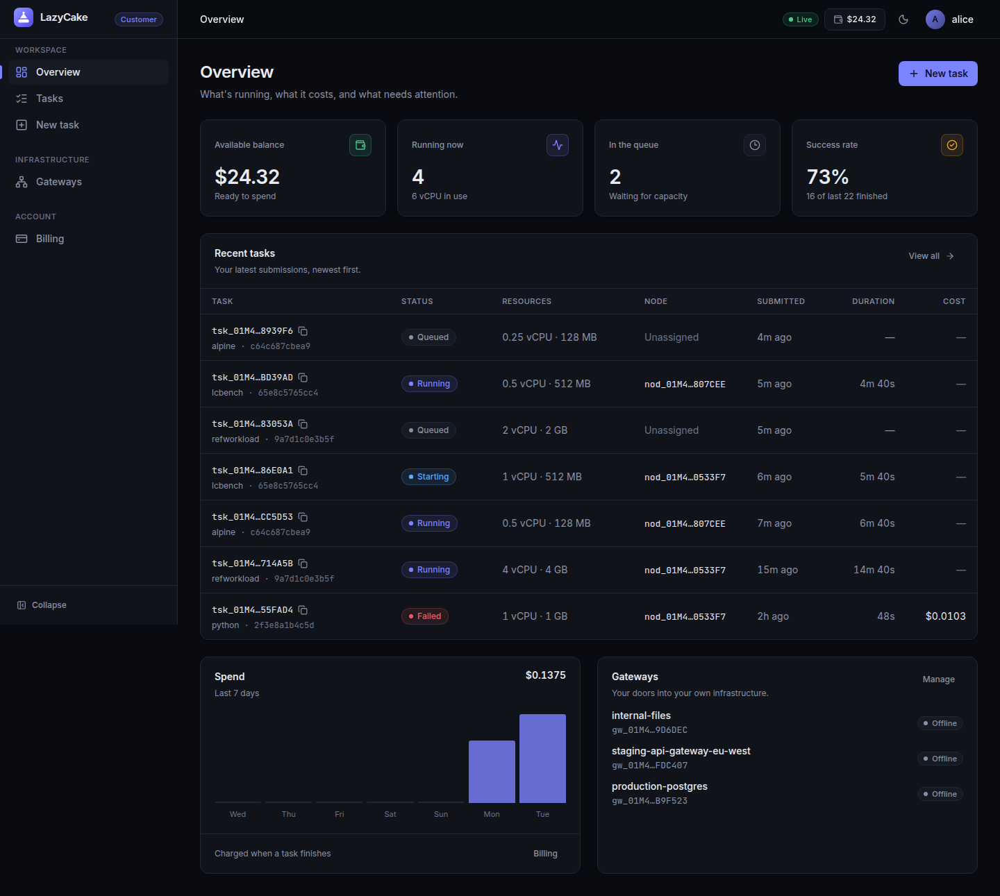
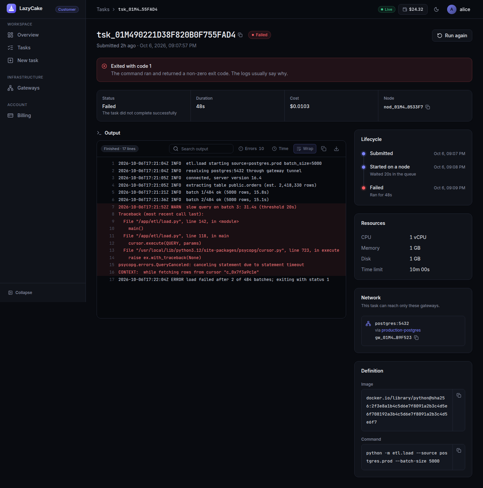
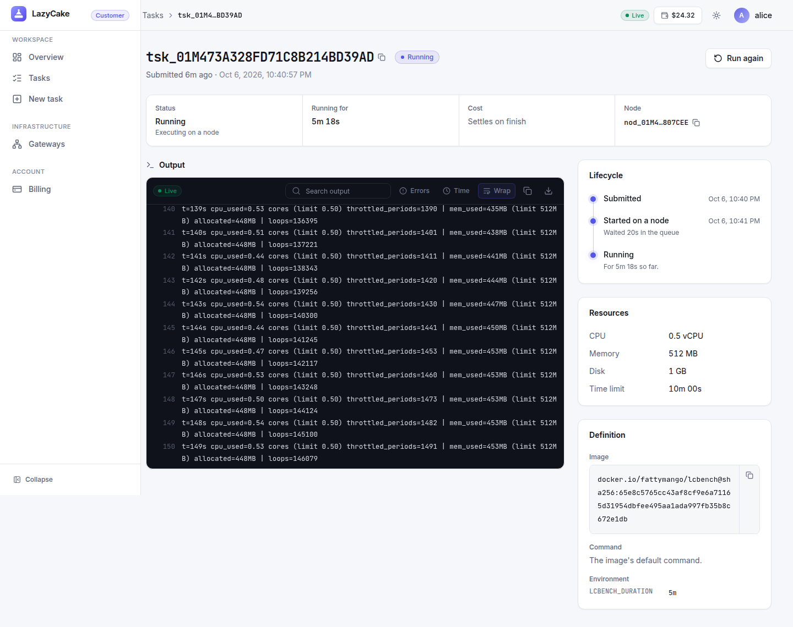
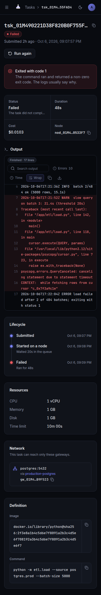
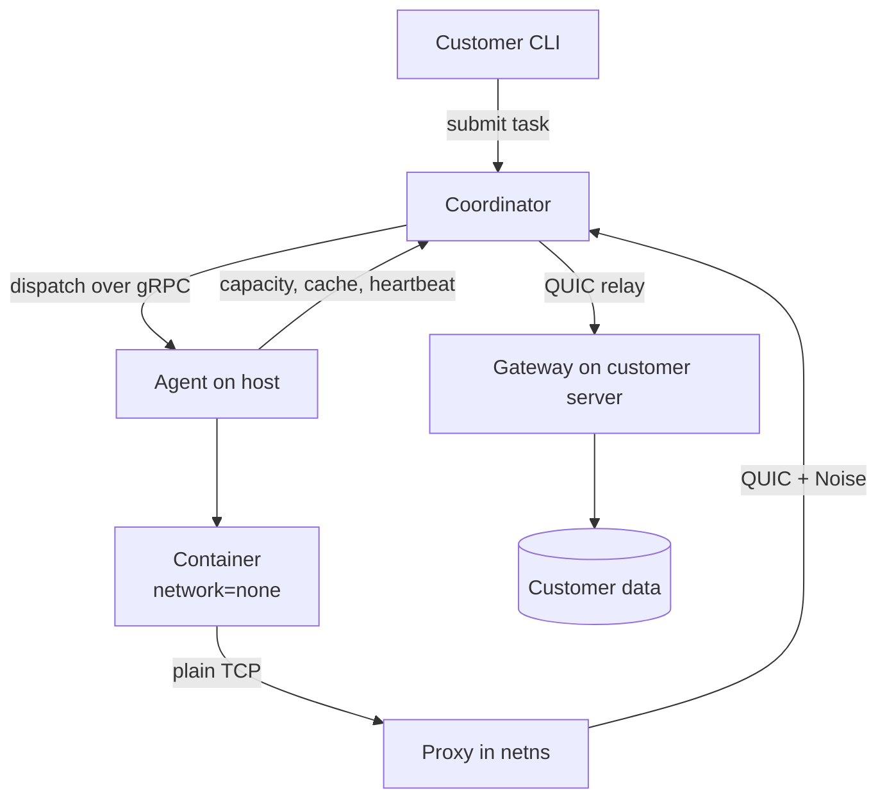

# LazyCake — a marketplace for leftover CPU

The chaos demo (`deploy/chaos-demo.sh`, task 6.4) submits 50 tasks, waits for
the fleet to pick them up, then `kill -9`s one agent mid-flight and shows the
dashboard reclaim and reschedule its work onto a survivor with no
double-execution. This has now been run for real, end to end, on a host with
working rootless cgroup v2 delegation: all 50 tasks reach `succeeded`,
including the one caught mid-flight on the killed agent, which fences via its
lapsed lease, requeues with `attempt` incremented, and gets picked up by a
survivor — see `docs/00-core-platform/PROGRESS.md`'s 6.3/6.4 entries for how
each piece was verified. Run it yourself and open `http://localhost:8080` to
watch it live.

## What it does

Hosts run an agent against their own rootless Podman, declare how much CPU,
RAM, disk and bandwidth they're willing to rent out, and get paid when a
customer's containers run on that hardware. Customers submit digest-pinned
batch containers — no interactive sessions, no SSH — and, if the task needs
to reach their own infrastructure, install a **gateway** next to it, which
both proves they control that destination and gives the platform an honest,
customer-owned byte counter no other marketplace of this shape has. The
project's actual subject is metering that neither side can game: normalised
billing so a throttled host can't out-earn a fast one, three independently
reported byte counts that have to agree, and a trust score that a dishonest
host has to survive.

## Quickstart

```sh
podman compose -f deploy/docker-compose.yml up
```

Brings up Postgres, runs migrations, starts the coordinator (gRPC on
`:7443`, QUIC relay on `:7444`, dashboard on `:8080`), a demo gateway, and
two demo agents — all seeded with a working demo customer token
(`demo-customer-token`), so there's nothing to configure by hand.

Open `http://localhost:8080` for the live dashboard, then submit a task:

```sh
export LAZYCAKE_COORDINATOR_ADDR=localhost:7443
export LAZYCAKE_TOKEN=demo-customer-token
go run ./cmd/lcctl submit --image docker.io/library/alpine@sha256:<digest> \
  --cpu 0.5 --memory 128 --disk 256 --timeout 60 -- echo hello
```

Watch it queue, dispatch, run and settle on the dashboard in real time. For
something that actually exercises the CPU-bound reference workload and its
`--count` fan-out, see `cmd/refworkload` and `deploy/chaos-demo.sh`.

## Public images

Prebuilt images are on Docker Hub, so a host or customer doesn't need to
build anything:

| Image | What it is |
| --- | --- |
| `docker.io/fattymango/lazycake-agent` | The host agent. The provider portal's "Add a machine" command pulls this. |
| `docker.io/fattymango/lazycake-gateway` | The gateway, always run as a container (`--network=host`, so it reaches the services on its own machine). The dashboard's "New gateway" command pulls this. |
| `docker.io/fattymango/lcbench` | A benchmark workload for checking a node enforces its limits. |

`lcbench` burns CPU on every host core and allocates memory for
`LCBENCH_DURATION` (default `60s`; `60`, `60s` and `1m` all work), printing
the container's cgroup usage next to the limits it was given once a second.
A capped task shows `cpu_used` pinned at `cpu_limit` with `throttled_periods`
climbing, and memory levelling off below `mem_limit`. Submit it with **empty
args** (the image's own entrypoint runs) and `LCBENCH_DURATION` as an env var.
Tasks need a digest-pinned image, so use the digest the registry reports
(`podman pull` then `podman image inspect` shows the *local* digest, which
differs from the registry's after a push).

## Web portals

Customers and providers get separate, authenticated web apps served by the coordinator itself (open
`http://localhost:8080` and sign in). Customers submit tasks, watch live logs, manage gateways and billing; providers
register machines and track earnings. See `web/README.md` for the design system and how to extend it.

| | |
| --- | --- |
|  |  |
|  |  |

## Architecture

Three components, and a strict split between the control plane and the data
plane — the coordinator dispatches and relays ciphertext it cannot decrypt;
it never sits in the actual data path.



**Coordinator** owns all state in Postgres, holds a gRPC stream per agent for
dispatch/heartbeat/capacity/logs, and separately relays QUIC tunnel frames it
cannot decrypt. The task queue is `SELECT ... FOR UPDATE SKIP LOCKED`, so
multiple replicas work with no message broker. **Agent** is one static Go
binary talking to Podman through the Docker-compatible socket API; it runs
its own capacity ledger and is the final authority on whether a dispatched
task actually fits, since the coordinator's view is always slightly stale.
**Gateway** is customer-installed, terminates the Noise session, forwards to
a local service, and counts bytes independently of the agent — the one
honest measurement point most marketplaces of this shape don't have.

## Design decisions

**Leases over a broker.** Every task carries a lease the coordinator extends
on each heartbeat it receives and requeues past if it stops hearing one
(`internal/coordinator/scheduler/reclaim.go`). This needs no message broker,
survives a coordinator restart (the lease state lives in Postgres, not
memory), and gives exactly one clock — the coordinator's own receive time —
authority over when a task is considered lost, rather than trusting either
side's notion of its own liveness.

**Self-fencing over kill-on-disconnect.** A disconnected agent doesn't wait
to be told to stop; it fences its own containers once its *own* deadline
(mirroring the coordinator's, measured from its last *sent* heartbeat) has
passed (`internal/agent/lease/watcher.go`). The alternative — the
coordinator killing tasks on a disconnected agent — can't actually stop
anything on a host it's lost contact with; self-fencing is the only version
of "stop" that a network partition can't also block. A blip costs nothing (a
missed heartbeat or two doesn't trigger anything); a partition longer than
the lease guarantees no split-brain window where both sides think a task is
still safely running.

**The gateway as the enforcement boundary, not the agent.** A container runs
with `--network=none`; every reachable target is a gateway the customer
themselves installed and registered. This is what makes "a task reaches at
most three registered gateways and nothing else" true regardless of what a
compromised or malicious agent does — the boundary is the customer's own
infrastructure proving it opted in, not a policy the host's software could
be tricked into bypassing.

**At-most-once by default.** A task that doesn't clearly tolerate re-running
against non-idempotent side effects (an API call with billing effects, say)
should not silently run twice just because a lease lapsed. `at_least_once`
is opt-in per task, for callers who know their own workload is safe to
retry (`cmd/refworkload`'s Monte Carlo pricer, for instance — every sampled
path is independent, so a fenced-and-requeued run just resumes with a fresh
seed and no state to reconcile).

**Normalised billing.** Billing on raw wall-clock rewards a host that
throttles itself — slower literally means more revenue for identical work.
Duration is multiplied by the node's own benchmark score relative to a
reference machine (`internal/agent/bench`, `internal/coordinator/billing`),
so a node running at half speed takes twice as long and earns the same
total, and a host that sandbags its benchmark to look slow just gets
deprioritised by the scheduler instead of paid more.

## Threat model

**A host on consumer hardware can read the workload running on their
machine, and this project says so plainly rather than implying otherwise.**

The host has root on their own hardware — they can read `/proc/<pid>/mem`,
attach a debugger, snapshot RAM, read the container filesystem straight off
their own disk, or run a patched kernel or a modified agent. No software
running on a machine can defend against software with more privilege on
that same machine, and rootless Podman gives nothing here: it protects the
host *from* the container, which is the opposite direction. The Noise layer
inside the tunnel protects the payload **from the relay operator**, not from
the host — the agent holds the Noise key and runs under the host's own
control, so "end-to-end encrypted" must never be read as a guarantee against
the node operator. The only real defence is a hardware TEE with remote
attestation (AMD SEV-SNP, Intel TDX), and consumer silicon doesn't have one
— that's a real second tier this design leaves deferred, not a gap it
pretends isn't there.

What's actually protected, and from whom:

| Against | Protected? | By what |
| --- | --- | --- |
| The relay operator reading payloads | Yes | Inner Noise session; the relay carries ciphertext only |
| A network observer | Yes | QUIC TLS plus Noise |
| The container attacking the host | Yes | Rootless Podman, user namespaces, seccomp, optional gVisor |
| The container reaching arbitrary hosts | Yes | No route exists outside the tunnel; every target is a registered gateway |
| A task DDoSing a third party | Yes | Gateway install proves control of the destination |
| **The host reading the workload** | **No** | Nothing — disclosed and mitigated (customer-side data minimisation, honeytokens for detection), never priced as solved |

Given that a host can't be stopped from reading the workload, correctness
also can't be checked by replicating it and comparing outputs — nothing here
ever sees the output to compare. What replaces that: benchmark
fingerprinting with periodic re-checks to catch spec lying
(`internal/coordinator/scheduler/specdrift.go`), coordinator-side timing
rather than agent self-report, three-point byte reconciliation across
agent/relay/gateway (`internal/coordinator/billing/reconcile.go`), canary
tasks dispatched against a platform-owned gateway where the expected
behavior is known in advance (`internal/coordinator/scheduler/canary.go`),
and a single trust score all of those signals feed into, driving both
sampling rate and dispatch eligibility (see below).

### Trust score

Every node has a trust score in `[0, 1]`, starting at `0.5`
(`internal/coordinator/scheduler/trust.go`, `TrustTracker`) — the single
number every fraud signal above feeds into, and the number placement and the
dispatch loop itself read back out.

The score is a running total, nudged by a fixed delta each time one of the
following happens, then clamped to `[0, 1]`:

| Event | Delta | Source |
|---|---|---|
| Clean completion (the host ran the task and reported honestly — any exit code) | `+0.01` | every `TaskSucceeded`/`TaskFailed` |
| Canary passed (verified by the platform's own gateway, not the agent) | `+0.02` | canary tasks |
| Canary failed (expected canary never showed up) | `-0.30` | canary tasks |
| Byte divergence (agent/relay/gateway counts disagree by >2%) | `-0.20` | byte reconciliation |
| Spec drift (measured durations diverge from the node's own baseline) | `-0.15` | spec verification |
| Abandonment (the node vanished mid-task) | `-0.25` | lease reclaim |

Positive events are small and additive — trust is earned slowly, one clean
task at a time. Negative events are large: a single canary failure alone
takes a perfectly-trusted node from `1.0` to `0.7`, and from the `0.5`
starting point to `0.2` — the ban threshold — in one shot. This is
deliberate: a false positive on the positive side just means a little extra
work sent to a node that hasn't quite earned it yet; a false negative on the
negative side means a node that's actually lying keeps getting real customer
workloads, which is the more expensive mistake. The asymmetry pushes the
system to err toward suspicion.

**Below `0.2` the node is banned** — the dispatch loop skips it entirely,
with no automatic path back in this codebase. Above that, trust score is
one term in placement alongside cache locality and queue depth, and it also
sets the canary rate itself — 5% of dispatches at low trust, 0.5% at high
trust, so a newly registered or already-suspicious node gets watched more
closely while a long clean history is checked less often (checking has a
real cost: it occupies a slot that could run revenue-generating work).

These numbers aren't derived from any external model — there's no historical
fraud data to calibrate against for a from-scratch marketplace. They were
chosen so that a single serious signal is never immediately erased by a few
clean tasks, an honest node converges to and stays near `1.0` under ordinary
operation, and a node dishonest on even a modest fraction of its tasks (not
every single one — an obvious cheat is a different, easier problem) crosses
the ban threshold within a bounded number of tasks rather than months of
activity. `internal/coordinator/scheduler/trust_test.go`'s
`TestTrustConvergence` exercises both ends: an honest node stays above `0.8`
through 50 tasks, and one caught by a realistic mix of the signals above on
roughly a fifth of its tasks crosses the ban threshold well within that same
window.

## Prior art

- **[HTCondor](https://htcondor.org/)** — mature high-throughput batch
  scheduling for machines one institution owns. No untrusted strangers, no
  money changing hands, so it never had to solve adversarial metering.
- **[BOINC](https://boinc.berkeley.edu/)** — untrusted volunteer machines at
  huge scale (SETI@home, Folding@home), but vetted scientific applications
  and no money — a volunteer has no financial incentive to cheat the way a
  paid host does.
- **[Bacalhau](https://github.com/bacalhau-project/bacalhau)** — compute
  over data you already have, assuming a cooperative fleet you (mostly) own
  or trust. Doesn't need to defend against a node operator actively lying
  about the work it did.
- **[Golem](https://github.com/golemfactory/yagna)** — the closest analogue:
  a real marketplace with real payment for untrusted compute. Leans more on
  reputation and market mechanics; this project's bet is that a small,
  concrete signal set (benchmark drift, byte reconciliation, canaries) beats
  a purely reputation-driven market at catching a specific host lying about
  specific things.
- **[Flux](https://github.com/orgs/RunOnFlux/repositories)** — a
  decentralised compute network with its own trust/collateral model,
  broader in scope (includes hosting, not just batch compute) than this
  project's deliberately narrow CPU-batch focus.

What makes this project distinct is holding three properties at once:
untrusted strangers' machines, real money changing hands, and arbitrary
customer containers. None of the above carries all three simultaneously,
which is exactly why none of them has to solve metering that neither party
can game — that problem is this design's actual centre of gravity, not an
afterthought bolted onto a scheduler.

## Limitations

- **No output-correctness verification.** Canary tasks prove a node
  *reached* the platform's gateway on schedule; nothing here checks the
  canary produced the *right* result. Verifying that requires a
  known-answer workload and a hash comparison the platform can't fake
  either — a real feature, deliberately left honestly unbuilt rather than
  faked (see `internal/coordinator/scheduler/canary.go`'s doc comment).
- **`PlacementScore` isn't wired into real dispatch.** The formula from
  `docs/00-core-platform/PLAN.md`
  (`internal/coordinator/scheduler/placementscore.go`) is implemented and
  tested, but the real claim loop is node-driven SQL
  (`SELECT ... FOR UPDATE SKIP LOCKED`) rather than the task-driven
  score-every-candidate shape the formula implies — genuinely reconciling
  the two is a real architectural change, not a bolt-on.
- **Tier A (attested TEE) confidentiality is entirely deferred.** Everything
  running today is Tier B: no confidentiality guarantee against the host,
  as the threat model above says outright.
- **No offer/bid matching, job fan-out, or scheduled availability windows** —
  all explicitly deferred in `docs/00-core-platform/PLAN.md`'s decision log,
  not rejected.
- **No macOS/Windows agent** — Linux with rootless Podman only.
- **No `systemd_slice`/`disk_limit` on every host.** `agent probe` degrades
  gracefully rather than refusing to start when a host lacks full cgroups v2
  delegation (`Delegate=yes` on `user.slice`) or the group access a rootless
  loop-mount needs — both drop one advertised capability each rather than
  blocking the agent, and neither affects `memory_limit`/`cpu_quota`, the two
  `agent probe` actually requires (see
  `docs/00-core-platform/OPEN_QUESTIONS.md`).

See `docs/00-core-platform/PLAN.md` for the full design rationale,
`docs/00-core-platform/IMPLEMENTATION.md` for the task-by-task build order,
`docs/00-core-platform/PROGRESS.md` for what's actually done and how it was
verified, and `docs/00-core-platform/OPEN_QUESTIONS.md` for every environment
limitation and open judgment call encountered along the way. Work on the
professional two-portal dashboard (lender portal + customer portal) is
planned in `docs/01-dashboard-portals/PLAN.md`.
